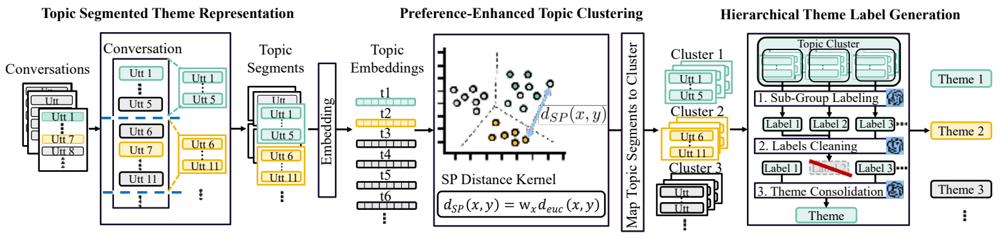
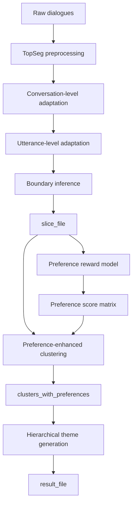

<div align="center">

# CATCH

### A Controllable Theme Detection Framework with Contextualized Clustering and Hierarchical Generation

<p>
  <a href="https://ojs.aaai.org/index.php/AAAI/article/view/40406"></a>
  <a href="https://dstc12.dstc.community/"></a>
  <a href="https://aclanthology.org/2025.dstc-1.6.pdf"></a>
  <a href="LICENSE"></a>
  
</p>



**Official code for the AAAI 2026 accepted paper [CATCH: A Controllable Theme Detection Framework with Contextualized Clustering and Hierarchical Generation](https://ojs.aaai.org/index.php/AAAI/article/view/40406).**

CATCH is also the **second-place solution** for the [DSTC-12 Controllable Topic Detection track](https://dstc12.dstc.community/), reported in the [DSTC-12 workshop paper](https://aclanthology.org/2025.dstc-1.6.pdf).

</div>

## News

- **2026**: CATCH was accepted by AAAI 2026.
- **2025**: CATCH ranked second in the DSTC-12 Controllable Topic Detection track.

## Overview

CATCH performs controllable theme detection through a three-stage pipeline:

| Stage | Module | Purpose | Main output |
| --- | --- | --- | --- |
| 1 | **TopSeg** | Context-aware topic segmentation for dialogue-level theme units. | `slice_file` |
| 2 | **PeC** | Preference-enhanced topic clustering with learned pairwise preference scores. | `clusters_with_preferences` |
| 3 | **HieGen** | Hierarchical theme label generation for clustered dialogue topics. | `result_file` |

The framework first segments conversations into contextual topic spans, then injects user or task preferences into topic clustering, and finally generates theme labels for target utterances.

## Repository Structure

```text
CATCH
|-- TopSeg/                  # Topic segmentation and adaptation models
|   |-- data_preprocess.py
|   |-- DDP_train.py
|   |-- preference_data_proprecess.py
|   `-- boundary_inference.py
|-- PeC/                     # Preference-enhanced clustering
|   |-- clustering.py
|   `-- preference_scalar/   # Preference reward model training and inference
|-- HieGen/                  # Hierarchical theme generation
|   `-- theme_labeling.py
|-- dstc12/                  # DSTC-12 evaluation and prompt utilities
|-- prompts/                 # Prompt templates
|-- run_evaluation.py        # Evaluation entry point
|-- eval.py                  # Evaluation utilities
`-- utils.py
```

## Quick Start

### 1. Prepare the environment

Create a Python environment and install the packages required by your runtime setup. The code uses PyTorch, Transformers, Accelerate, Datasets, scikit-learn, UMAP, tqdm, and LangChain HuggingFace integrations.

```bash
conda create -n catch python=3.10
conda activate catch

pip install torch transformers accelerate datasets scikit-learn umap-learn tqdm langchain-huggingface
```

If you use local LLMs or embedding models, make sure the corresponding model paths are accessible before running PeC and HieGen.

### 2. Run TopSeg

TopSeg produces the dialogue segmentation file used by the following stages.

```bash
cd TopSeg
python data_preprocess.py \
  --dataset <raw_dataset_name_or_path> \
  --save_name <preprocessed_dataset_name>
```

Train the conversation-level adaptation model:

```bash
torchrun DDP_train.py \
  --dataset dstc12 \
  --save_model_name dstc12 \
  --epoch 4
```

Prepare preference data for utterance-level adaptation:

```bash
python preference_data_proprecess.py \
  --dataset <dataset_path> \
  --preference_data <preference_annotation_path> \
  --output_dir <processed_preference_dir>
```

Train the utterance-level adaptation model:

```bash
torchrun DDP_train.py \
  --dataset dstc12_preference \
  --save_model_name dstc12_preference \
  --epoch 6
```

Infer dialogue boundaries:

```bash
python boundary_inference.py \
  --model <topseg_model_name_or_path> \
  --dataset <dataset_name_or_path> \
  --save_name <slice_file_name>
```

### 3. Run PeC

PeC trains a preference reward model, generates a pairwise preference score matrix, and performs preference-enhanced clustering.

```bash
cd ../PeC/preference_scalar
python train_PRM.py \
  <model_path> \
  <save_path> \
  <org_dataset> \
  <slice_file> \
  <pref_file>
```

Generate the preference score matrix:

```bash
python preference_generation.py \
  <org_dataset> \
  <slice_data> \
  <model> \
  <score_matrix_save_path>
```

Run preference-enhanced clustering:

```bash
cd ..
python clustering.py \
  <org_dataset_file> \
  <dataset_file> \
  <preferences_file> \
  <slice_file> \
  <score_matrix> \
  <clusters_with_preferences>
```

Useful optional arguments:

```bash
--n-clusters 10
--random-state 42
--embedding-model-name <sentence_embedding_model_name_or_path>
--llm-name <llm_name_or_path>
```

### 4. Run HieGen

HieGen assigns generated theme labels to the target utterances.

```bash
cd ../HieGen
python theme_labeling.py \
  <org_dataset_file> \
  <clusters_with_preferences> \
  <result_file> \
  --n-clusters 10 \
  --llm-name <llm_name_or_path>
```

### 5. Evaluate

```bash
cd ..
python run_evaluation.py \
  <ground_truth_file> \
  <predictions_file> \
  --embedding-model-name <embedding_model_name_or_path> \
  --llm-name <llm_name_or_path>
```

## Data Flow



## Inputs and Outputs

| Name | Description | Produced by | Consumed by |
| --- | --- | --- | --- |
| `org_dataset_file` | Original dialogue dataset in JSONL format. | User | PeC, HieGen, evaluation |
| `pref_file` / `preferences_file` | Preference annotations for should-link and cannot-link relationships. | User | PeC |
| `slice_file` | Dialogue segmentation result. | TopSeg | PeC |
| `score_matrix` | Pairwise topic preference scalar matrix. | PeC PRM inference | PeC clustering |
| `clusters_with_preferences` | Cluster assignments after preference-aware adjustment. | PeC clustering | HieGen |
| `result_file` | Final theme-labeled prediction file. | HieGen | Evaluation |

## Notes

- Some scripts expect positional arguments while others use named arguments. The commands above follow the current script interfaces.
- Several model-related defaults in the code point to local paths. Replace them with your accessible Hugging Face model names or local checkpoints.
- The file `TopSeg/preference_data_proprecess.py` keeps the current repository spelling for compatibility with the existing code.

## Contact

For code questions, bug reports, or reproduction issues, please open a GitHub issue in this repository. For paper-specific questions, refer to the author information on the [AAAI article page](https://ojs.aaai.org/index.php/AAAI/article/view/40406).

## Citation

If this repository is useful for your research, please cite CATCH:

```bibtex
@inproceedings{ke2026catch,
  title={CATCH: A Controllable Theme Detection Framework with Contextualized Clustering and Hierarchical Generation},
  author={Ke, Rui and Xu, Jiahui and Yang, Shenghao and Wang, Kuang and Jiang, Feng and Li, Haizhou},
  booktitle={Proceedings of the AAAI Conference on Artificial Intelligence},
  volume={40},
  number={37},
  pages={31419--31428},
  year={2026}
}
```

The DSTC-12 track report is available here:

```bibtex
@inproceedings{shalyminov2025controllable,
  title={Controllable conversational theme detection track at DSTC 12},
  author={Shalyminov, Igor and Su, Hang and Vincent, Jake W and Singh, Siffi and Cai, Jason and Gung, James and Shu, Raphael and Mansour, Saab},
  booktitle={Proceedings of the Twelfth Dialog System Technology Challenge},
  pages={74--90},
  year={2025}
}
```

## License

This project is released under the [MIT License](LICENSE).
